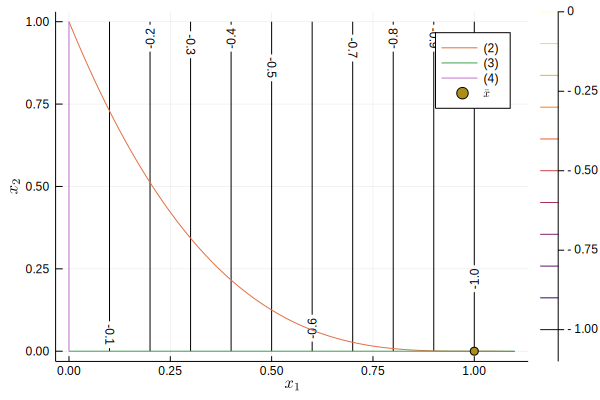
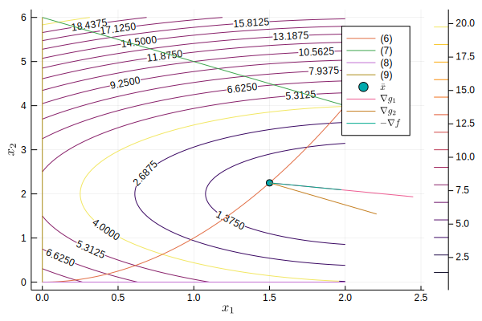

# Homework 4.1 FJ and KKT Conditions at Optimal Point

## (a)
The feasible region and the optimal point $\bar{x}=(1, 0)$ are drawn in the figure \ref{fig:1}.

## (b)
From the optimization problem, we have
$$
\begin{aligned}
f(x) &= -x_1 \\
g_1(x) &= x_2 - (1-x_1)^3 \\
g_2(x) &= -x_1 \\
g_3(x) &= -x_2.
\end{aligned}
$$

The optimal point $\bar{x}$ is Fritz-Jones (FJ) point if there exists a nonzero $(u_0,u_1,u_2,u_3)$ and $u_i≥0$ such that
$$
u_0 ∇f(\bar{x}) + ∑_{i=1}^3 u_i ∇g_i(\bar{x}) = 𝟎.
$$

We can show that
$$
u_0 \left[\begin{matrix}-1\\0\end{matrix}\right] + 
u_1 \left[\begin{matrix}0\\1\end{matrix}\right] +
u_2 \left[\begin{matrix}-1\\0\end{matrix}\right] +
u_3 \left[\begin{matrix}0\\-1\end{matrix}\right]
= \left[\begin{matrix}0\\0\end{matrix}\right]
$$
is satisfied by values $(0, 1, 0, 1)$. Therefore, $\bar{x}$ satisfies Fritz-John (FJ) conditions.

## (c)
The KKT conditions are valid in $\bar{x}$ if there exists $(u_1,u_2,u_3)$ such that
$$
∇f(\bar{x}) + ∑_{i=1}^3 u_i ∇g_i(\bar{x}) = 𝟎.
$$

We can show that a solution to 
$$
\left[\begin{matrix}-1\\0\end{matrix}\right] + 
u_1 \left[\begin{matrix}0\\1\end{matrix}\right] +
u_2 \left[\begin{matrix}-1\\0\end{matrix}\right] +
u_3 \left[\begin{matrix}0\\-1\end{matrix}\right]
= \left[\begin{matrix}0\\0\end{matrix}\right]
$$
does not exist, because it would require $u_2=-1<0$. Therefore, the KKT conditions are not satisfied.

Linear independence CQ does not hold. Gradients $∇g_1(\bar{x})$ and $∇g_3(\bar{x})$ are not linearly independent.

Slater's CQ doesn't hold. Function $g_1$ is not convex.

\pagebreak

# Homework 4.2 KKT Conditions for a Quadratic Problem

## (a)
From the optimization problem, we have
$$
\begin{aligned}
f(x) &= (x_1 - 9/4)^2 + (x_2 - 2)^2 \\
g_1(x) &= x_1^2 - x_2 \\
g_2(x) &= x_1 + x_2 - 6 \\
g_3(x) &= -x_1 \\
g_4(x) &= -x_2.
\end{aligned}
$$

The optimal point
$$
\bar{x} = (3/2, 9/4).
$$

The KKT condition hold if there exists $(u_1, u_2, u_3, u_4)$ such that
$$
∇f(\bar{x}) + ∑_{i=1}^4 u_i ∇g_i(\bar{x}) = 𝟎.
$$

We can derive a solution as follows.
$$
\left[\begin{matrix}- \frac{3}{2}\\ \frac{1}{2}\end{matrix}\right] + \  
u_1 \left[\begin{matrix}3\\-1\end{matrix}\right] + \  
u_2 \left[\begin{matrix}1\\-1\end{matrix}\right] + \  
u_3 \left[\begin{matrix}-1\\0\end{matrix}\right] + \  
u_4 \left[\begin{matrix}0\\-1\end{matrix}\right]
=
\left[\begin{matrix}3 u_{1} + u_{2} - u_{3} - \frac{3}{2}\\- u_{1} - u_{2} - u_{4} + \frac{1}{2}\end{matrix}\right] = \left[\begin{matrix}0\\0\end{matrix}\right].
$$
In another form we have
$$
\begin{cases}
u_3 = 3u_1 + u_2 - 3/2 ≥ 0 \\
u_4 = u_1 + u_2 - 1/2 ≥ 0
\end{cases}.
$$
By setting $u_3=0$ and $u_4=0$ we have
$$
\begin{cases}
u_3 = 3u_1 + u_2 - 3/2 = 0 \\
u_4 = u_1 + u_2 - 1/2 = 0
\end{cases},
$$
which has a solution $(u_1, u_2, u_3, u_4)=(1/2, 0, 0, 0)$. Therefore, the KKT conditions hold.

## (b)
The feasible region is drawn in the figure \ref{fig:2}. As can be seen, $-∇f$ is inside the cone spanned by the gradients $∇g_1$ and $∇g_2$, graphically verifying the KKT conditions.

## (c)
The point $\bar{x}$ is a unique global optimal because the function $f$ is convex and the constraints $g_1, g_2, g_3$ and $g_4$ are convex, that is, Slater's CQ holds.

# Homework 4.3 Lagrangian Dual of a Least-Squares Problem
## (a)
The Lagrangian dual of the least-squares problem is
$$
θ(v) = \inf \{ϕ(v)∣x∈X\},
$$
where the Lagrangian function is
$$
ϕ(v) =x^T x + v^T (Ax-b)
$$
with decision variables $x∈𝐑^n$, the problem data $A∈𝐑^{m×n}$ and $b∈𝐑^m$ and the dual variables $v∈𝐑^m$.

## (b)

$$
\begin{aligned}
θ(v) &= \inf \{ϕ(v)∣x∈X\} \\
&= \inf \{x^T x + v^T (Ax-b)∣x∈X\} \\
&= \inf \{x^T x + v^TAx - v^Tb∣x∈X\} \\
...
\end{aligned}
$$

...

$$
\sup \{θ(v)∣v≥0\}
$$

# Homework 4.4 Concavity of Lagrangian Dual Functions
The Lagrangian dual function is defined
$$
θ(w) = \inf\{f(x)+w^T β(x) : x∈X\}
$$
where $w=(u,v)$ and $β=(g(x), h(x))$.

The function $θ(w)$ is concave if the function $ϕ(w)=-θ(w)$ is convex. Therefore, we need to show the convexity of the function
$$
ϕ(w)=\sup\{f(x)+w^T β(x) : x∈X\}.
$$

**Proof**: We have $λ∈(0, 1)$ then
$$
\begin{aligned}
ϕ(λw_1 + (1-λ)w_2) &= \sup\{f(x)+(λw_1 + (1-λ)w_2)^T β(x) : x∈X\} \\
&= \sup\{f(x)+λw_1^Tβ(x) + (1-λ)w_2^T β(x) : x∈X\} \\
&= \sup\{λ(f(x)+w_1^Tβ(x)) + (1-λ)(f(x)+w_2^T β(x)) : x∈X\} \\
&≤ \sup\{λ(f(x)+w_1^Tβ(x)) : x∈X\} + \sup\{(1-λ)(f(x)+w_2^T β(x)) : x∈X\} \\
&= λ\sup\{f(x)+w_1^Tβ(x) : x∈X\} + (1-λ)\sup\{f(x)+w_2^T β(x) : x∈X\} \\
&= λ ϕ(w_1) + (1-λ) ϕ(w_2).
\end{aligned}
$$

<!-- # References -->
