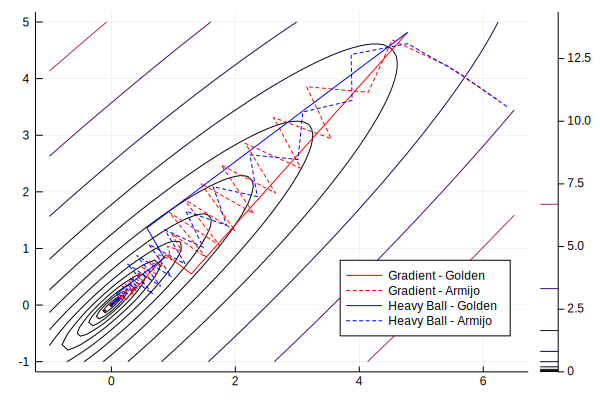
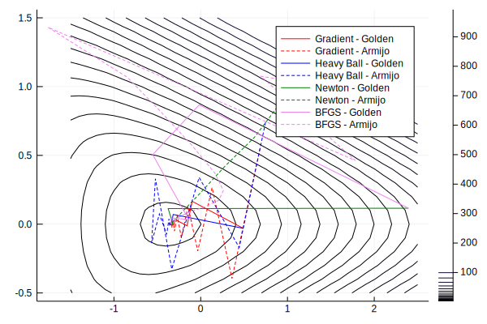
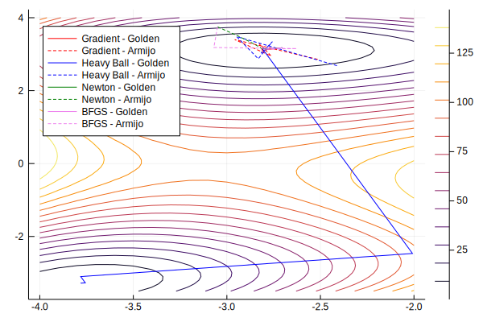

# Project description
## Optimization Methods
This project compares the performance of different unconstrained optimization methods. Conceptually, an unconstrained optimization method is implemented as follows:

**Input**: Method specific parameters, maximum iteration limit $N$ and solution tolerance $ϵ$.

**Output**: Optimal value $x_k$.

1) Initialize with iteration counter $k=0$ and starting point $x_0$.
2) Each iteration $k$, compute direction $d_k$ and stepsize $λ_k$. Then update the current position $x_{k+1} = x_k + λ_k d_k$ and the iteration counter $k=k+1$.
3) Stop when either $|∇f(x_k)|<ϵ$ or an iteration limit $N$ is reached. Return $x_k$.

As can be seen, the idea is to take a step of size $λ_k$ into a direction $d_k$ each iteration $k$ until optimality condition is reached, that is, the gradient is close enough to zero. 

The algorithms used to analyze the optimization methods may also collect and return the whole iteration sequence $x_1,...,x_k$.

The following direction and stepsize algorithms were implemented. Four variants for computing direction:

1) *Gradient method*.
2) *Gradient method with momentum (Heavy-Ball)*. It has weight parameter $w∈(0, 1)$.
3) *Newton's method*.
4) *Broyden–Fletcher–Goldfarb–Shanno (BFGS) method*.

Two variants for computing stepsize:

1) *Golden linesearch* (exact). It has two parameters, initial lower bound $a_0$ and initial upper bound $b_0$.
2) *Armijo linesearch* (inexact). It has three parameters, slope reduction factor $α_0$, $λ$-reduction factor $β_0$ and initial step size $λ_0$.

Direction and stepsize algorithm can be combined into an optimization method. Then, the performance of different combinations can be measured and compared against each other.

## Implementation
The algorithms were implemented and tested using [Julia programming language](https://julialang.org/), version 1.1, in [Jupyter](https://jupyter.org/) notebook.  `TimerOutputs.jl` was used for timing and comparing performance of functions. Timing in Julia is explained in depth by @timing_in_julia. Plotting was done using `Plots.jl`. The full code for the optimization methods and performance metrics is available in a Jupyter notebook: `optimization_methods.ipynb`.

# Numerical results
| Detail | Value |
|--------|-------|
| Operating system | Ubuntu 16.04 |
| Memory (RAM) | 16 GiB |
| Processor | Intel Core i5-7600K CPU @ 3.80GHz $\times$ 4 |

Table: Computer details \label{fig:1}

The optimization methods were tested against four different functions. Each subsection describes the particular test function, plots the convergence of each optimization method and execution times of each optimization method tested against the function. Details about the computer used for timing are listed in table \ref{fig:1}.

The numerical paramater for the different optimization methods are set as follows:

* $α_0$
* $β_0$
* $w$
* $N=10000$
* $a_0=0$
* $b_0=10$
* $λ_0=1$
* $ϵ = 10^{-5}$

In the results, the optimization methods are referred using notation *direction - stepsize*, for example, *Gradient - Golden* refers to Gradient method with Golden linesearch.

## Function 1

Function 1 is defined as
$$
f_1(x_1,x_2) = 0.26 (x_1^2+x_2^2) - 0.48 x_1 x_2.
$$
The iteration starting point
$$
x_0 = (7.0, 3.0)
$$

| Method | Time | Iterations
| ------ | ---- | ----------
| Gradient - Armijo | $206\,μs$ | 142
| Heavy Ball - Armijo | $148\,μs$ | 94
| Gradient - Golden | $96\,μs$ | 15
| Heavy Ball - Golden | $84\,μs$ | 13

Table: Performance of optimization methods on function 1.

## Function 2

Function 2 is defined as
$$
f_2(x_1,x_2) = \exp(x_1+3x_2-0.1) + \exp(x_1-3x_2-0.1)+\exp(-x_1-0.1).
$$
The iteration starting point
$$
(1, 1.5)
$$

| Method | Time | Iterations
| ------ | ---- | ----------
| Gradient - Golden | $135\,μs$ | 17
| BFGS - Armijo | $106\,μs$ | 31
| BFGS - Golden | $95\,μs$ | 8
| Gradient - Armijo | $78\,μs$ | 32
| Heavy Ball - Armijo | $71\,μs$ | 33
| Newton - Golden | $66\,μs$ | 5
| Heavy Ball - Golden | $63\,μs$ | 7
| Newton - Armijo | $56\,μs$ | 9

Table: Performance of optimization methods on function 2.

## Function 3

Function 3 is defined as
$$
f_3(x_1,x_2) = (x_1^2+x_2-11)^2+(x_1+x_2^2-7)^2.
$$
The iteration starting point
$$
(-2, 2)
$$

| Method | Time | Iterations
| ------ | ---- | ----------
| Gradient - Golden | $266\,μs$ | 8
| Heavy Ball - Golden | $240\,μs$ | 11
| BFGS - Armijo | $236\,μs$ | 37
| Gradient - Armijo | $232\,μs$ | 35
| Newton - Armijo | $175\,μs$ | 25
| Heavy Ball - Armijo | $159\,μs$ | 28
| Newton - Golden | $124\,μs$ | 4
| BFGS - Golden | $99\,μs$ | 4

Table: Performance of optimization methods on function 3.

## Function 4
The function 4 is defined as
$$
f(x) = (1/2) x^T Ax - b^T.
$$

Two cases: $A$ has

1) Low condition number
2) High condition number

# Discussion and conclusions

# References
