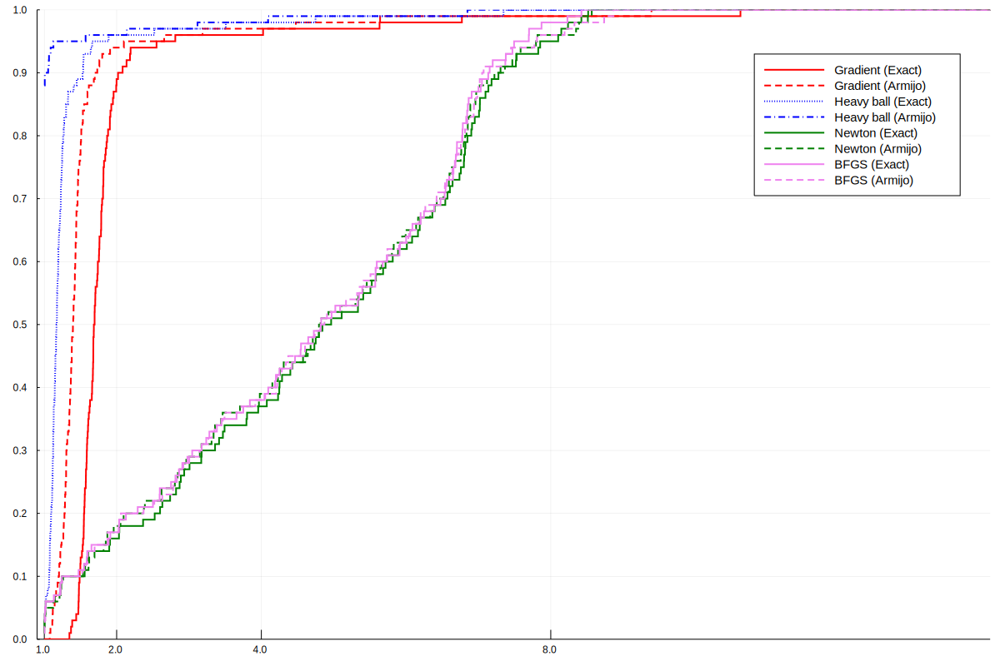
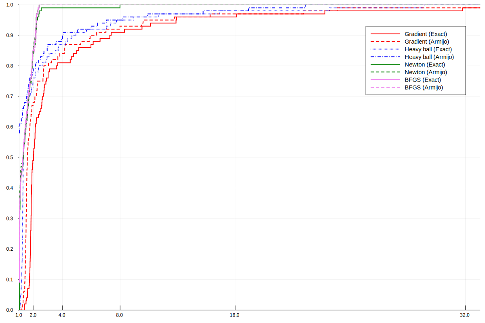

\begin{center}
{\Large \onehalfspacing \bf Comparing Unconstrained Optimization Methods}
\end{center}
\vspace{10pt}

\begin{center}
Jaan Tollander de Balsch\\
{\textit{{\small{Aalto University School of Science, Department of Computer Science, 
                \{de.tollander@aalto.fi\}}}}}
\end{center}

# Project description
The purpose of this project is to compare the performance of different unconstrained optimization methods.  As a reference to the theory of unconstrained optimization methods, we used the lecture notes @lectures, which are based on the course textbook, @nonlinear_programming_3rd.

## Unconstrained Optimization Method
Conceptually, an unconstrained optimization method is implemented as follows:

---

**Input**: Continuous and differentiable function $f$, solution tolerance $ϵ$, maximum iteration limit $N$ and method specific parameters.

**Output**: Point $x_k$ in which the function value $f(x_k)$ is optimal.

1) Initialize with iteration counter $k=0$ and starting point $x_0$.

2) Each iteration $k$, compute direction $d_k$ and stepsize $λ_k$. Then update the current position $x_{k+1} = x_k + λ_k d_k$ and the iteration counter $k=k+1$.

3) Stop when either $|∇f(x_k)|<ϵ$ or an iteration limit $N$ is reached. Return $x_k$.

---

The idea is that the algorithm takes a step of size $λ_k$ into a direction $d_k$ each iteration $k$ until it reaches the optimality condition. Numerically, the optimality condition is that the gradient is close enough to zero; that is, the norm of the gradient is less than the set tolerance $ϵ$. If the function $f$ is convex or quasi-convex, the solution $x_k$ is global optima, otherwise, $x_k$ is a local optima.

The algorithms used to analyze the optimization methods may also collect and return the whole iteration sequence $x_1,...,x_k$. The sequence can then be plotted to visualize the convergence of the method.

## Variants of Unconstrained Optimization Method
We can implement different variants of unconstrained optimization methods by using different methods to compute the direction and step size. The direction can be computed using *gradients*, that is, first-order derivative information or *Hessians*, that is, second-order derivative information. The stepsize, that is, *optimal* stepsize, is solved as a unidimensional optimization problem using line search algorithms. Both the direction and step size can be computed using exact or inexact (heuristic) algorithms. In this project, we implemented four variants of direction algorithms and two variants of stepsize algorithms. 

The direction algorithm computes the direction at the current position $x$.

1) *Gradient method*. Uses gradient for computing the direction.

2) *Gradient method with momentum (Heavy-Ball)*. Uses a convex combination of the current and previous gradient for computing the direction. It has weight parameter $w∈(0, 1)$.

3) *Newton's method*. Uses exact Hessian for computing the direction.

4) *Broyden–Fletcher–Goldfarb–Shanno (BFGS) method*. Uses an approximation of Hessian for computing the direction. The BFGS update itself is a rule on how to update the Hessian approximation. A quasi-Newton method.

Stepsize algorithm finds the optimal stepsize $\bar{λ}$ by solving the unidimensional optimization problem
$$
\bar{λ}=\operatorname{argmin}_λ f(x+λd)
$$
where $x$ is the current position and $d$ is the current direction.

1) *Golden line search*. An exact algorithm. It has two parameters, initial lower bound $a_0$ and initial upper bound $b_0$.

2) *Armijo line search*. An inexact algorithm. It has three parameters, slope reduction factor $α_0$, $λ$-reduction factor $β_0$, and initial step size $λ_0$.

## Implementation
The algorithms were implemented and tested using [Julia programming language](https://julialang.org/), version 1.1, in [Jupyter](https://jupyter.org/) notebook. `TimerOutputs.jl` was used for timing and comparing the performance of functions. Timing in Julia is explained more in-depth by @timing_in_julia. Plotting was done using `Plots.jl`. The detailed implementation of the algorithms, performance measurements and plots is available in the Jupyter notebook supplied along with the report.

# Numerical results
| Detail | Value |
|--------|-------|
| Operating system | Ubuntu 16.04 |
| Memory (RAM) | 16 GiB |
| Processor | Intel Core i5-7600K CPU @ 3.80GHz $\times$ 4 |

Table: Computer details. \label{table:1}

We measured the performance of the optimization methods against four different functions. Each subsection describes the particular test function, plots the convergence of each optimization method, and execution times of each optimization method tested against the function. Note, because Julia used just-in-time (JIT) compiler, Julia compiles functions on the first function call with that specific signature. Therefore, when timing Julia-functions, they need one warmup function call before the actual measurement. We listed the details about the computer used for timing in table \ref{table:1}.

The numerical paramater for the different optimization methods are set as follows:

* $α_0=0.01$
* $β_0=0.7$
* $w=0.2$
* $N=10000$
* $a_0=0$
* $b_0=10$
* $λ_0=1$
* $ϵ = 10^{-5}$

In the results, we referred to the different optimization methods using notation *direction - stepsize*, for example, *Gradient - Golden* refers to the Gradient method with Golden line search.

## Function 1

Function 1 is defined as
$$
f_1(x_1,x_2) = 0.26 (x_1^2+x_2^2) - 0.48 x_1 x_2,
\label{func:f1}
\tag{1}
$$
with starting point $(7.0, 3.0).$ The function 1 is a convex function.

| Method | Time | Iterations
| ------ | ---- | ----------
| Gradient - Armijo | $190\,μs$ | 142
| Heavy Ball - Armijo | $165\,μs$ | 94
| Gradient - Golden | $115\,μs$ | 15
| Heavy Ball - Golden | $94\,μs$ | 13

Table: Performance of optimization methods on function 1. Times are averages of 1000 measurements. Iterations are the number of iterations until the method converged to a solution. \label{table:2}

## Function 2

Function 2 is defined as
$$
f_2(x_1,x_2) = \exp(x_1+3x_2-0.1) + \exp(x_1-3x_2-0.1)+\exp(-x_1-0.1),
\label{func:f2}
\tag{2}
$$
with starting point $(1.0, 1.5).$ The function 2 is a convex function.

\pagebreak

| Method | Time | Iterations
| ------ | ---- | ----------
| Gradient - Golden | $132\,μs$ | 17
| BFGS - Armijo | $97\,μs$ | 31
| BFGS - Golden | $76\,μs$ | 8
| Heavy Ball - Armijo | $71\,μs$ | 33
| Heavy Ball - Golden | $63\,μs$ | 7
| Gradient - Armijo | $56\,μs$ | 32
| Newton - Golden | $48\,μs$ | 5
| Newton - Armijo | $27\,μs$ | 9

Table: Performance of optimization methods on function 2. Times are averages of 1000 measurements. Iterations are the number of iterations until the method converged to a solution. \label{table:3}

## Function 3

Function 3 is defined as
$$
f_3(x_1,x_2) = (x_1^2+x_2-11)^2+(x_1+x_2^2-7)^2,
\label{func:f3}
\tag{3}
$$
with starting point $(-2.0, 2.0).$ Function 3 is not a convex function. This is evident from the figure \ref{fig:f3} where *Heavy Ball - Golden* can be seen to convergence to different local optimum compared to the other methods.

| Method | Time | Iterations
| ------ | ---- | ----------
| BFGS - Armijo | $117\,μs$ | 37
| Heavy Ball - Golden | $78\,μs$ | 11
| Newton - Armijo | $77\,μs$ | 25
| Gradient - Golden | $61\,μs$ | 8
| Heavy Ball - Armijo | $60\,μs$ | 28
| Gradient - Armijo | $51\,μs$ | 35
| BFGS - Golden | $32\,μs$ | 4
| Newton - Golden | $31\,μs$ | 4

Table: Performance of optimization methods on function 3. Times are averages of 1000 measurements. Iterations are the number of iterations until the method converged to a solution. \label{table:4}

## Function 4

The function 4 is defined as
$$
f_4(x) = (1/2) x^T Ax - b^T, x∈𝐑^{150}.
\label{func:f4}
\tag{4}
$$
where $A$ is positive-definite matrix. The function 4 is a convex function.

The iteration starting points is
$$
(1, 1, ..., 1)∈𝐑^{150}.
$$

We measured the performance of different optimization methods in two cases:

1) When $A$ has a moderate condition number.
2) When $A$ has a higher condition number.

In each case, the measurement is done using 100 distinct instances with random $A$ and $b$. The resulting measurement, seen in figures \ref{fig:f4_moderate} and \ref{fig:f4_high}, are represented using *performance ratios* as described by @benchmarking_optimization. 

The performance ratio $τ$ is defined as the timing of a specific instance divided by the minimum timing of all instances of all optimization methods. Performance ratio of $τ=1$ represents the quickest timing, and for example, $τ=4$ means that instance took $4$ times longer than the fastest instance of all optimization methods.

In the figures \ref{fig:f4_moderate} and \ref{fig:f4_high}, the $x$-axis is the performance ratio $τ$ and the $y$-axis is the cumulative distribution of performance ratios. The cumulative distribution describes the probability that a particular method has reached an optimal solution with a performance ratio of less or equal to $τ$.

We see that when $A$ has a moderate condition number, the gradient-based methods, Gradient, and Heavy ball, converge faster than the Hessian based methods. Vice versa, when $A$ has a higher condition number, the Hessian based methods, Newton and BFGS, converge faster than the gradient-based methods.

In gradient-based methods, the Amirjo line search seems to outperform Golden. In Hessian based methods, both Amirjo and Golden line search versions seem to perform equally well.

# Discussion and conclusions
The optimization methods produce solution that are global optima when applied to functions that are (quasi) convex. Functions \ref{func:f1}, \ref{func:f2}, and \ref{func:f4} are convex, and thus their solutions are global.

Optimization methods on functions \ref{func:f1}, \ref{func:f2}, and \ref{func:f3} are ranked by their performance in tables \ref{table:2}, \ref{table:3}, \ref{table:4}. For each method, the timing is an average of 1000 individual timings.

Evident from the tables \ref{table:2}, \ref{table:3}, and \ref{table:4}, methods using Armijo line search perform more iterations compared to methods using Golden line search. This can be seen as the zigzag pattern in the convergence of methods using Armijo in figures \ref{fig:f1}, \ref{fig:f2}, and \ref{fig:f3}. However, the Armijo line search is much faster to compute than the Golden line search. Therefore, methods using the Amirjo line search can be faster than their counterpart method, that is, for the same direction algorithm, using the Golden line search, as can be seen in figures \ref{fig:f4_moderate} and \ref{fig:f4_high}.

# References
