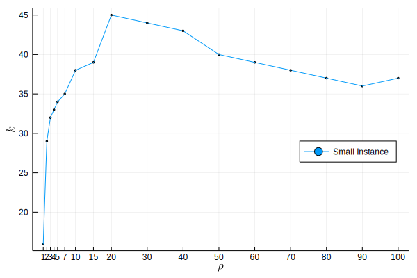

\begin{center}
{\Large \onehalfspacing \bf Solving Large-Scale Optimization Problems with ADMM}
\end{center}
\vspace{10pt}

\begin{center}
Jaan Tollander de Balsch\\
{\textit{{\small{Aalto University School of Science, Department of Computer Science, 
 \{de.tollander@aalto.fi\}}}}}
\end{center}

# Background
In this report, we examine the *alternating direction method of multipliers* (ADMM), a distributed constrained convex optimization method, suitable for solving large scale optimization problems. ADMM combines the benefits of *dual decomposition* and *augmented Lagrangian* methods for constrained optimization. The dual decomposition method is a distributed variant of the *dual ascent* method possible when the objective function is *separable*. The augmented Lagrangian brings robustness to the *dual ascent* method and yields convergence without assumptions such as strict convexity finiteness of the objective function.

@admm covers the ADMM extensively. This report heavily relies on the paper, especially sections 1, 2, 3, and 5.

## Algorithm
The ADMM algorithm solves problems in the form
$$
\begin{aligned}
\mathrm{minimize}\quad & f(x) + g(z) \\
\mathrm{subject\, to}\quad & Ax + Bz = c
\end{aligned}
$$
with variables $x∈𝐑^n$ and $z∈𝐑^m$, and parameters $A∈𝐑^{p×n}$, $B∈𝐑^{p×m}$, and $c∈𝐑^p.$

The augmented Lagrangian takes form
$$
L_ρ(x,z,v) = f(x) + g(z) + v^T (Ax+Bz-c) + (ρ/2) \|Ax+Bz-c\|_2^2,
$$
where $v∈𝐑^m$ is the *dual variable* and $ρ>0$ is referred as the *penalty parameter*.

The ADMM algorithm consists of the following iterations
$$
\begin{aligned}
x_{k+1} &= \operatorname{argmin}_x L_ρ(x, z_{k}, v_{k}) \\
z_{k+1} &= \operatorname{argmin}_z L_ρ(x_{k+1}, z, v_{k}) \\
v_{k+1} &= v_{k} + ρ(Ax_{k+1}+Bz_{k+1}-c).
\end{aligned}
$$

The algorithm updates the variables $x$ and $z$ in alternating fashion, hence the term *alternating direction*.

## Convergence and Stopping Criteria
A *residual* at iteration $k$ is defined as
$$
r_k = Ax_k + Bz_k - C.
$$

We assume that the functions $f$ and $g$ are closed, proper and convex, and the unaugmented Lagrangian has as saddle point, then ADMM convergences as the iterations $k→∞$ as follows.

* The *residual converges* towards zero, that is, $r→0$.
* The *objective value converges* towards the optimal.
* The *dual variable converges* towards the dual optimal point.

In practical implementation, ADMM will stop when the residual is below a tolerance $ϵ>0$, that is, $r<ϵ$.  Because ADMM converges slowly to high accuracy but can reach a modest accuracy with relatively few iterations, the tolerance $ϵ$ is set relatively high compared to methods converge to high accuracy. However, many practical applications do not require high accuracy to produce good results. For example, in machine learning, a slightly more optimal model fit would not produce much better predictions.

## Generic Algorithm
The generic constrained optimization problem defined as
$$
\begin{aligned}
\mathrm{minimize}\quad & f(x) \\
\mathrm{subject\, to}\quad & x ∈ X.
\end{aligned}
$$

We can write the problem in ADMM form as
$$
\begin{aligned}
\mathrm{minimize}\quad & f(x) + g(z) \\
\mathrm{subject\, to}\quad & x - z = 0
\end{aligned}
$$
where $g$ is the indicator function of $X$.

The augmented Lagrangian function take form
$$
L_ρ(x,z,v) = f(x) + g(z) + v^T (x-z) + (ρ/2) \|x-z\|_2^2.
$$

The ADMM algorithm consists of the following iterations
$$
\begin{aligned}
x_{k+1} &= \operatorname{argmin}_x L_ρ(x, z_{k}, v_{k}) \\
z_{k+1} &= \operatorname{argmin}_z L_ρ(x_{k+1}, z, v_{k}) \\
v_{k+1} &= v_{k} + ρ(x_{k+1}-z_{k+1}).
\end{aligned}
$$

We will use the generic form when applying ADMM to the problem in the next section.

# Applications
In this section, we derive the ADMM formulation for the *stochastic capacity expansion problem*. The objective function is defined as
$$
∑_{i∈I} c_i x_i + ∑_{s∈S} p_s \left(∑_{i∈I}∑_{j∈J}f_{i,j}y_{i,j,s} + ∑_{j∈J} q_j u_{j,s}\right)
$$
with parameters $c_i,f_{i,j},q_{j}$ and probabilities $p_s$.

The problem is separable in terms of scenarios $S$. We need to introduce the scenario dependent variables $x_s$ for the variable $x$ such that
$$
∑_{s∈S} p_s f(x_s) = ∑_{s∈S} p_s \left(∑_{i∈I} c_i x_{i,s} + ∑_{i∈I}∑_{j∈J}f_{i,j}y_{i,j,s} + ∑_{j∈J} q_j u_{j,s}\right).
$$

The augmented Lagrangian is form as
$$
L_ρ(x_s,z,v_s) = f(x_s) + g(z) + v_s^T (x_s - z) + (ρ/2) \|x_s-z\|_2^2.
$$

We have $g(z)=0$ and $v^T z = 0$
$$
L_ρ(x_s,z,v_s) = f(x_s) + v_s^T x_s + (ρ/2) \|x_s-z\|_2^2.
$$

<!-- $$
\begin{aligned}
& ∑_{s∈S} p_s L_ρ(x_s,z,v_s) = \\
& ∑_{s∈S} p_s \left(∑_{i∈I} c_i x_{i,s} + ∑_{i∈I}∑_{j∈J}f_{i,j}y_{i,j,s} + ∑_{j∈J} q_j u_{j,s} + v_s^T x_s + (ρ/2) \|x_s-z\|_2^2\right) 
\end{aligned}
$$ -->

---

The ADMM algorithm consists of the following iterations
$$
\begin{aligned}
x_s^{k+1} &= \operatorname{argmin}_{x_s} L_ρ(x_s, z^{k}, v_s^{k}) \\
z^{k+1} &= \operatorname{argmin}_z ∑_{s∈S} p_s L_ρ(x_s^{k+1}, z, v_s^{k}) \\
v_s^{k+1} &= v_s^{k} + ρ(x_s^{k+1}-z^{k+1}).
\end{aligned}
$$
with a stopping criterion
$$
∑_{s∈S} p_s ρ \|x_s^{k+1}-z^k\|_2 < ϵ,
$$
where $ϵ>0$.

---

Since $z$ is unconstrained, we can obtain the $z$ update by taking the gradient and setting it to zero.
$$
\begin{aligned}
∇_z L_ρ(x_{k+1}, z, v_{k}) &= 0 \\
∑_{s∈S} p_s ρ(x_s^{k+1}-z) &= 0
\end{aligned}
$$
with $∑_{s∈S} p_s=1$ yields
$$
z^{k+1} = ∑_{s∈S} p_s x_s^{k+1}.
$$

\pagebreak

# Discussion and Conclusions

We experimented with two instances of the stochastic capacity expansion problem. The small instance has $|S|=100$ and a large instance has $|S|=500$,  and both have $|I|=20$ and $|J|=30$. 

For both instances, we analyzed the number of iterations $k$ as a function of the penalty parameter $\rho$ for convergence with solution tolerance $ϵ=10^{-1}$. Figures \ref{fig:1} and \ref{fig:2} visualize how the number of iterations grows as the penalty parameters grows for both instances. In other words, the performance of ADMM is best with a lower penalty parameter.

Instance | Deterministic | ADMM ($ρ=1$)
- | ------------- | ----
Small | $20$ s | $16$ s
Large | $205$ s | $106$ s

Table: Comparison of the performance of the deterministic method and ADMM. \label{table:1}

We also compared the performance of the deterministic method, that is, solving the problem using the interior point method, and ADMM.  As can be seen in table \ref{table:1}, ADMM is faster than the deterministic method for the large instance. ADMM is faster because it parallelizes the problem and uses multiple processors for computing the solution.

\pagebreak

# References